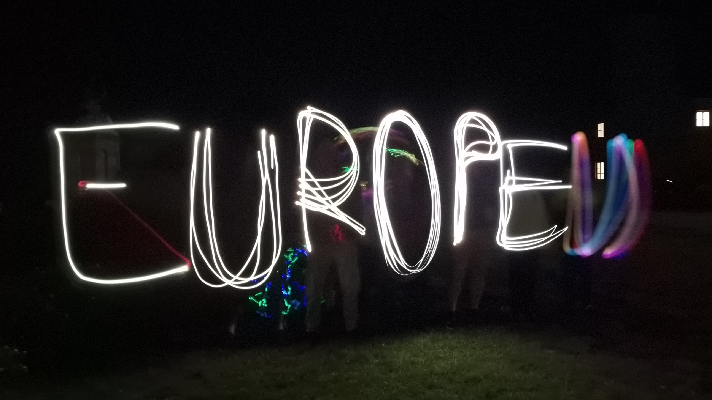
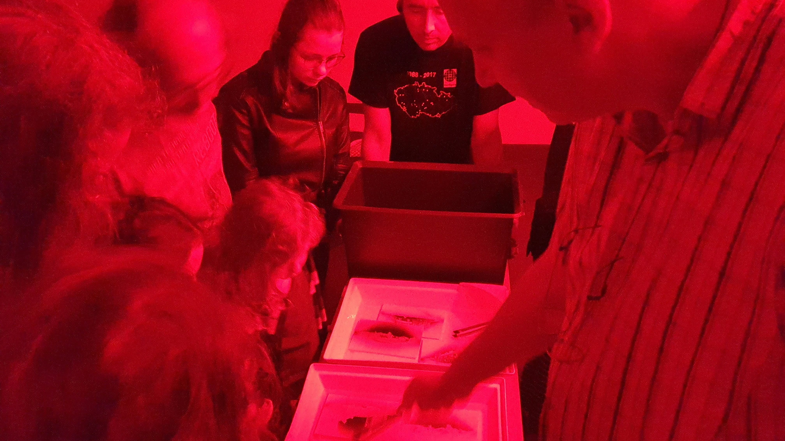


<a class="btn btn-lg btn-primary me-3 mb-4" href="#td-block-2">
  Program semináře
</a>
<a class="btn btn-lg btn-secondary me-3 mb-4" href="#td-block-3">
  Zapojit se
</a>

20.-22. září 2024 <a href="https://www.zameknectiny.cz/">zámek Nečtiny</a>

Dva dny plné zábavy, experimentů a nových možností jsou určeny
pro malé i velké, v programu je něco pro každého člena rodiny. Program vzniká složením nápadů, času a nadšenectví, přispět může každý. Podívejte se na seznam aktivit, doplňujte další nápady, navrhujte jak
pobavit sebe i mladší generaci a něco zajímavého se přiučit.
<a href="#td-block-3">více o přípravě semináře</a> 




{}
Seminář pro malé i velké
{.h1}
 
{}
  {}
  
  {}
  {}
  
  
  {}
  {}
  
  
  {}
{}

{}

{}
Co bude na programu?
{.h1}

<!--<a class="btn btn-lg btn-primary me-3 mb-4" href="https://europen.zcu.cz/Anot/56/56poz.pdf">
  Pozvánka (PDF)
</a>
<a class="btn btn-lg btn-primary me-3 mb-4" href="https://form.simpleshop.cz/8ozyW/">
  Přihlásit se
</a>-->

Formát semináře
{.h3}

- **Pátek** možno přijet v pátek večer a účastnit se neformálního setkání u večeře a vyhnout se rannímu cestování.
- **Sobota** *začátek 10h, program do večera*, součástí je oběd a večeře. Zámek Nečtiny nabízí nejen učebny, ale i možnost pokusů a
atrakcí v zámeckém parku, v případě nepříznivého počasí je možné část aktivit přesunout do tělocvičny. Využití členitého parku a malebného okolí zámku na různé technické i netechnické činnosti. Letecký den (drony, hydraulické a pneumatické rakety), večerní cesta k hrobce, různé aktivity
v parku. Táborák a v případě dobrého počasí pozorování oblohy s odborným výkladem, rojení broučků s lucerničkami či kolektivní tvorba noční fotografie s dlouhou expozicí.
- **Neděle** *organizovaný program od 9 do 13h*, poté oběd a individuální program podle počasí a situace (okolní houbařské lesy a turistické cíle). Tradiční je také podpora fotografům, sdílené fotografické pískoviště a inspirace pro práci se světlem. [Popis okolí a možných výletů](https://www.zameknectiny.cz/vylety).

Program
{.h3}
- **Veletrh** Trvalá instalace, předváděčka různého vybavení orientovaného na osvojení moderních
technologií a získání inspirace. 3D tiskárny, vyšívací stroj, programovatelná ruka, chytré diody,
robotický bublifuk, Gravitrax a mnoho dalšího. *Máte sami nějakou zajímavou hračku či přístroj?
Přivezte je a pochlubte se ostatním.* Součástí akce je výstavka různých výrobků a část určená pro
nejmenší (interaktivní tabule, zvířátková telefonní ústředna).
- **Workshopy a aktivity** Kratší akce v menší učebně vypsané na konkrétní čas. Doba trvání 30-60 minut. Příklady *přednášek a workshopů*:
• Minecraft, programování v Javě a IoT stavebnice ESPcraft
• Práce s papírem, výroba hraček a experimentů, recyklace materiálů
• Mikroskopie, zábavné optické experimenty
• Nebojte se focení mobilem, pracujeme s dlouhou expozicí
• Praktická (bio)chemie
• Jednoduché elektronické obvody, LED svítítka, motůrky a další
• Kouzla s chemií
• Stavba raket, testy pohonů a soutěžní letecký den
• Šicí a vyšívací dílna, praktický workshop
• Venkovní aktivity, orientační běh, lukostřelba, drony.
- **Konzultační a servisní koutek** Přivezte si, co vám nefunguje. Specialisté IoT labu se pokusí vaše nefunkční elektronické zařízení
opravit a zprovoznit. A možná vám ukáží jak na to.

Pro koho je program určen?

Většina aktivit je určena pro děti 8-15 let, případně i pro mladší za podpory rodičů. Myslíme ale na každého, nezapomínáme na maminky (šicí dílna) ani na teenagery, kterým speciálně doporučujeme zapojit se do organizace a ad-hoc aktivit pro mladší kamarády.

{}

{}
Jak se mohu na programu podílet?
{.h1}

V Nečtiněch je aktivním účastníkem každý. Přesto se skupina organizátorů musí zformovat předem, vše dohodnout, připravit, nakoupit materiál, vydat program. Proto se nám prosím *ozvěte, program vzniká složením nápadů, času a nadšenectví pod vedením Jiřího Boříka*. Ozvěte se na **email: borik@civ.zcu.cz**
<!--
**Slovo předsedy programového výboru**
{.h3}-->



Vážení a milí,

podzimní workshop v Nečtinech se blíží, tentokrát si dejte do kalendáře rezervaci na víkend 20.-22.9.2024

Formát akce je tradiční, technické a rukodělné aktivity pro mladší ročníky (výrobek ze dřeva ručními nástroji, senzorová lampička, šicí kroužek...) a také blok přednášek, co by mohly zaujmout i dospělý doprovod (soutěže vodíkových autíček, domácí výroba medoviny...).

Program si tvoříme sami, takže kdo máte něco dalšího zajímavého, nebojte se mi napsat. Inspiraci z předchozích let najdete na https://europen.cz/f

Na viděnou se těší,

Jiří Bořík
za organizátory workshopu EurOpen v Nečtinech


{}

<!-- your comment text Nested shortcodes with % notation interpret indentation - pre/code block shows up here  -->
<!-- https://github.com/gohugoio/hugo/issues/11272  -->
{}

**Programový výbor**
Jiří Bořík,
Pavel Jindra,
Jiří Sitera,
Zdeněk Šustr

**Hlavní organizační partner**
IoT laboratoř ZČU - https://iotlab.zcu.cz/

{}


{}

